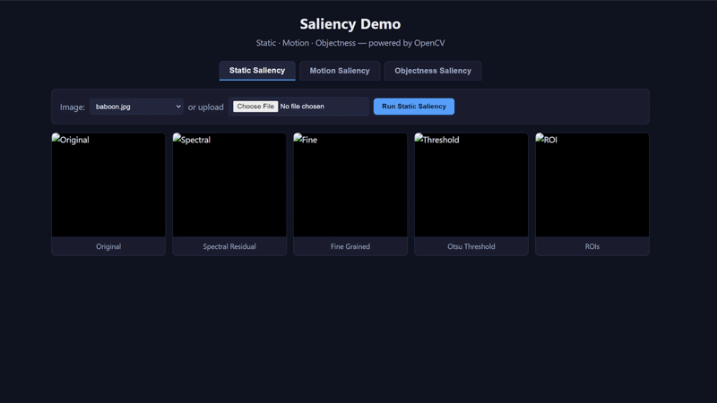
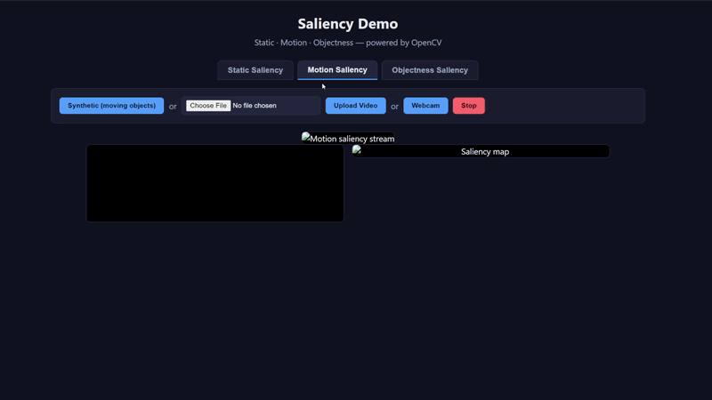
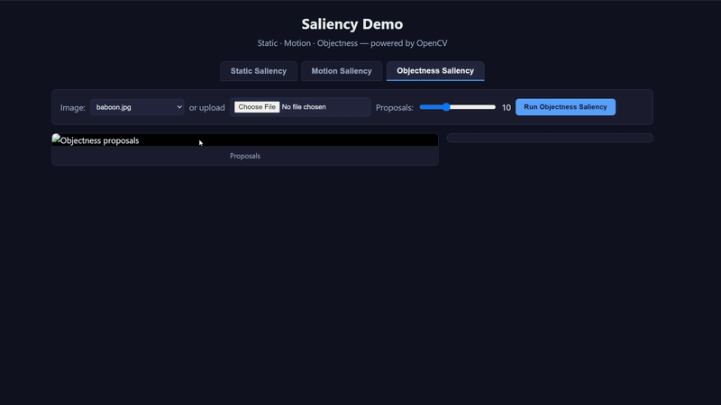

# Saliency Demo

Interactive visualization of three saliency algorithms from OpenCV (`opencv-contrib`), plus an original set of command-line scripts. Includes a Flask web app that runs the saliency computation server-side and shows the results in the browser.

## Saliency algorithms

| Tab / Script | Algorithm | OpenCV class |
| --- | --- | --- |
| **Static** | Spectral Residual + Fine Grained saliency, then Otsu thresholding + contour extraction to produce ROI boxes | `StaticSaliencySpectralResidual`, `StaticSaliencyFineGrained` |
| **Motion** | Spatiotemporal motion saliency over a frame sequence | `MotionSaliencyBinWangApr2014` |
| **Objectness** | BING objectness proposals (bounding boxes ranked by object likelihood) | `ObjectnessBING` |

## Demo

**Static**



**Motion**



**Objectness**



## Requirements

- Python 3.8+
- `opencv-contrib-python`, `numpy`, `matplotlib`, `flask`

```bash
pip install -r requirements.txt
```

## Web app

```bash
python app.py
```

Then open http://127.0.0.1:5000.

- **Static tab** — pick an image from `images/` or upload one. Shows original, spectral residual, fine-grained, Otsu threshold, and the extracted ROI boxes with a count.
- **Motion tab** — three modes:
  - *Synthetic*: a stream of moving circles, displayed side-by-side with the live motion saliency map (no camera/file needed).
  - *Upload video*: upload an `.mp4`/`.avi`/etc., and the processed side-by-side stream plays back. (Result is streamed as MJPEG — no ffmpeg required — so there are no seek controls.)
  - *Webcam*: uses `getUserMedia` and sends frames to the server for live saliency. Requires serving from `localhost` (or HTTPS), otherwise browsers block camera access.
- **Objectness tab** — same image source, with a slider for the number of proposals. Shows the top-N bounding boxes, color-coded and listed with coordinates.

## Command-line scripts

Original scripts from before the web app, still usable directly:

```bash
# Static: side-by-side spectral + fine-grained + threshold + ROI boxes
python static_saliency.py -i images/lena.jpg

# Browse all images in a folder (arrow keys = next/prev, q = quit)
python saliency_viewer.py -i images/
python saliency_viewer.py -i images/ -d   # debug: show all maps

# Motion: synthetic moving objects (no camera/file), or a video / webcam / stream
python motion_saliency.py --synthetic
python motion_saliency.py -i video.mp4
python motion_saliency.py                  # webcam
python motion_saliency.py -u http://<phone-ip>:4747/video   # e.g. DroidCam

# Objectness: BING proposals using the bundled model
python objectness_saliency.py -m objectness_trained_model -i images/lena.jpg -n 10
```

## Project structure

```
.
├── app.py                      # Flask web app (serves static/ and all endpoints)
├── static/                     # Frontend (vanilla HTML/JS/CSS, no build step)
│   ├── index.html
│   ├── style.css
│   └── app.js
├── saliency_utils.py           # Shared helpers (static saliency, threshold, ROI extraction)
├── static_saliency.py          # CLI: static saliency
├── motion_saliency.py          # CLI: motion saliency (synthetic/video/webcam/stream)
├── objectness_saliency.py      # CLI: objectness (BING) saliency
├── saliency_viewer.py          # CLI: browse a folder of images
├── images/                     # Sample input images
├── objectness_trained_model/   # BING objectness model files (from OpenCV contrib)
└── requirements.txt
```

## Notes

- The BING model files in `objectness_trained_model/` come from the OpenCV contrib samples (`objness` model).
- Webcam access requires a secure context, so use `http://localhost:5000` or HTTPS.
